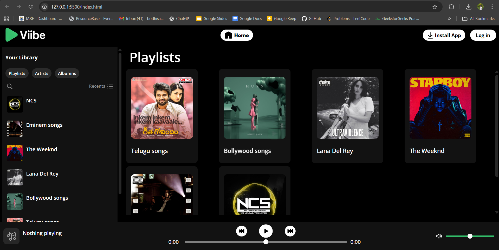

# 🎧 Viibe Music Player

A simple and elegant **web-based music player** built using **HTML, CSS, and JavaScript**.  
Viibe lets you enjoy your favorite tracks with a clean UI, smooth controls, and simple playlist handling.

---

## 🚀 Features

- 🎵 Play, pause, skip, and replay songs  
- 📂 Manage playlists using `playlists.json`  
- 💫 Visual music-playing animations  
- 💻 Responsive design for all screen sizes  
- ⚡ Fast and lightweight — runs fully client-side  
- 🧠 Built with pure HTML, CSS, and vanilla JS (no frameworks)

---

## 🖼️ Demo / Screenshots

Example:  


---

## 🛠️ Getting Started

### Prerequisites
- Any modern web browser (Chrome, Edge, Firefox, Safari)
- No backend or server setup required

### Installation
Clone the repository to your local system:
```bash
git clone https://github.com/Bodhisattva-Duduka/Viibe-Music-Player.git
cd Viibe-Music-Player
```

### Usage
1. Open `index.html` in your browser.  
2. Use the controls to **Play / Pause / Skip** songs.  
3. Modify `playlists.json` to add or remove songs:  
   ```json
   {
     "title": "Song Title",
     "artist": "Artist Name",
     "src": "assets/song.mp3"
   }
   ```
4. Place your audio files (`.mp3`) in the `assets/` folder.  
5. (Optional) Customize player design in `musicPlayer.css` or functionality in `musicPlayer.js`.

---

## 📁 Project Structure

```
Viibe-Music-Player/
│
├── assets/                     # Audio files, images, icons
├── index.html                  # Main entry page
├── musicPlayer.html            # Alternative player UI
├── musicPlayingAnimation.html  # Animation showcase
├── musicPlayer.css             # Styles for player
├── style.css                   # Global styles
├── musicPlayer.js              # Core JavaScript logic
├── script.js                   # Playlist / event handling
├── playlists.json              # Song data (title, artist, src)
└── song.mp3                    # Example track
```

---

## 💡 Future Enhancements
- 🔁 Shuffle and repeat functionality  
- 📱 Improved mobile UI  
- 🕹️ Volume control and progress bar  
- 💾 Local storage for last played track  

---


## 🙌 Acknowledgements
- Built with using HTML, CSS & JavaScript  
- Inspired by classic music player UIs  

---

Made by [**Bodhisattva Duduka**](https://github.com/Bodhisattva-Duduka)
